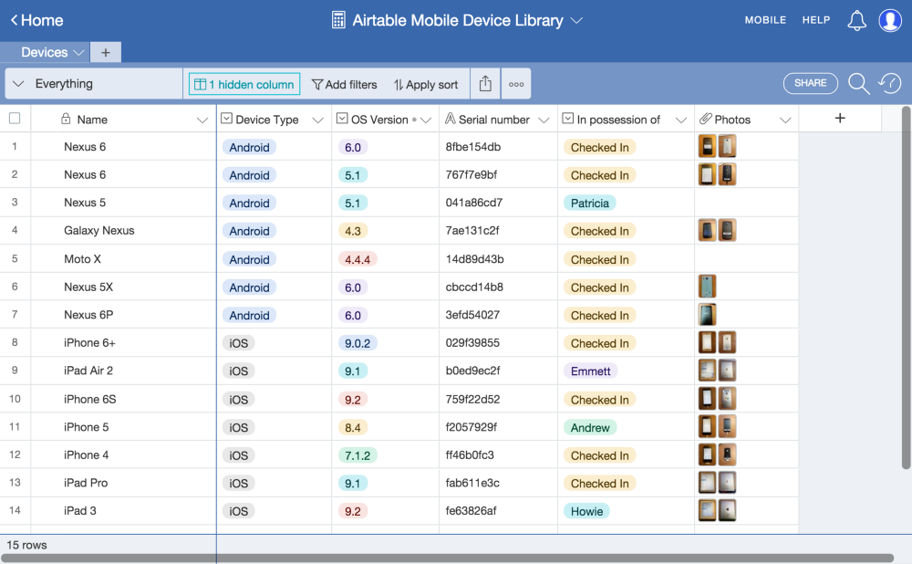
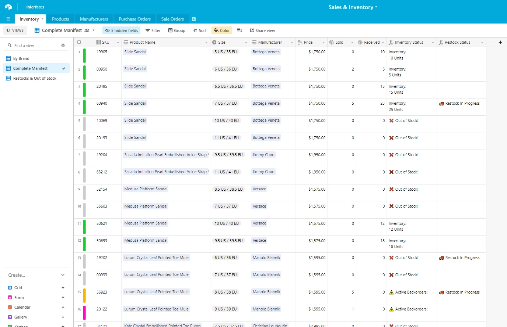
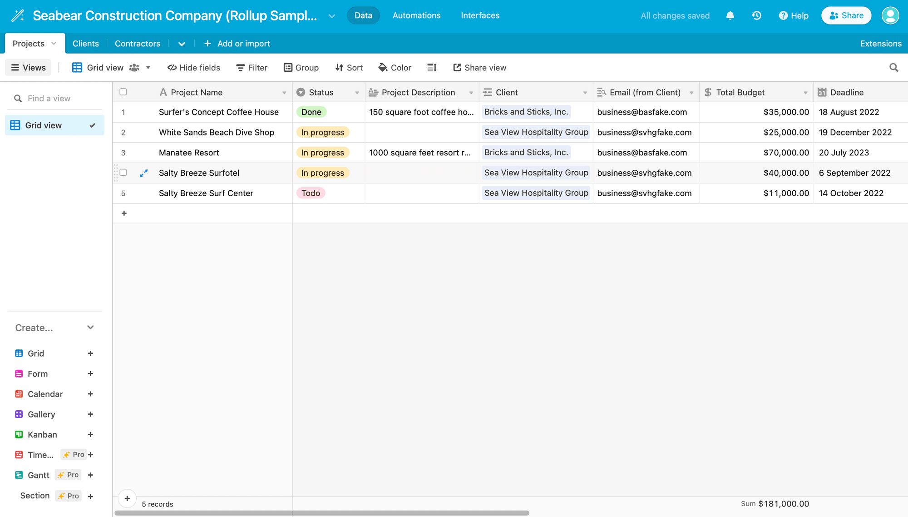
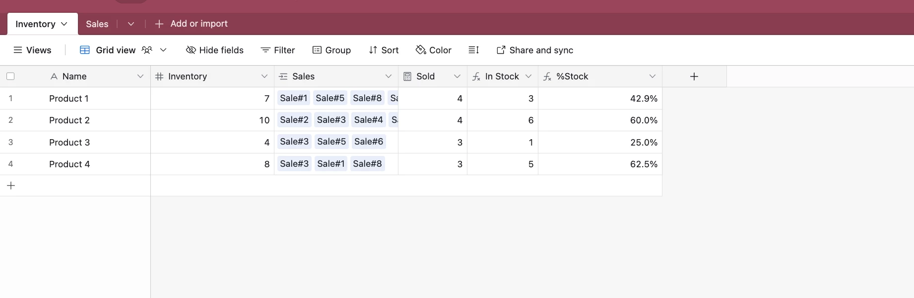
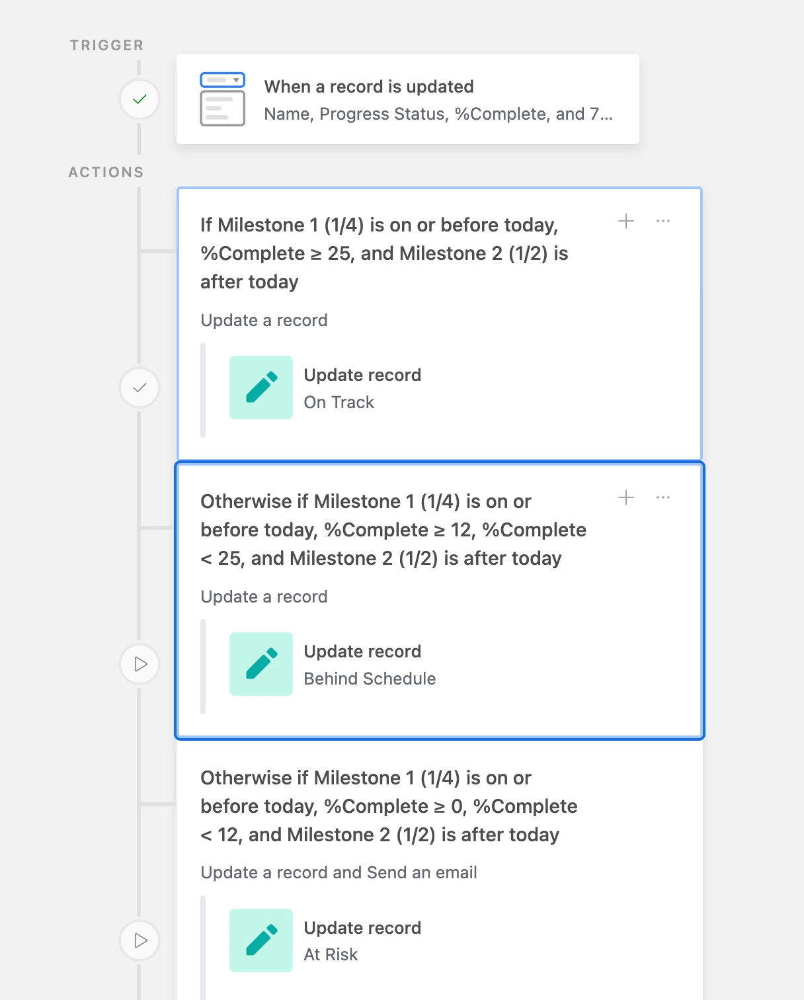
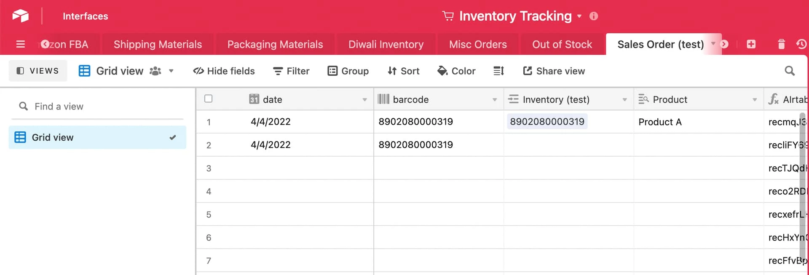

# Barcode-Based Inventory Management System

## Overview
This project implements a barcode-driven inventory management system that tracks SKU-level inventory movements across stores and locations. The system uses transaction-based inventory accounting, automated reconciliation, and demand-driven replenishment logic to mirror real-world WMS/ERP inventory control.

## Key Features
- Barcode-style transaction ledger (RECEIVE, SALE, MOVE, ADJUST, CYCLE COUNT)
- Automated inventory roll-up using signed quantities
- Real-time on-hand inventory calculation
- Reconciliation against inventory snapshots
- Reorder point, safety stock, and days-of-supply logic
- Airtable automations to eliminate manual linking errors

## System Architecture
Inventory is never manually updated. All stock levels are derived from transaction history:

Starting Inventory  
+ Receipts  
− Sales  
± Adjustments  
= Current On-Hand

## Tools Used
- Airtable (Inventory system, automations, dashboards)
- Spreadsheet-based sample data (for demonstration)
- Inventory planning logic (ROP, safety stock)

## Business Logic
- Positive quantities increase inventory
- Negative quantities decrease inventory
- Composite Store–SKU keys ensure correct record matching
- Reorder alerts are triggered based on demand and lead time

## Outputs & Planning Views

### Inventory Transactions (Barcode Scans)

### Live Inventory Calculation

### Reorder Decisions

### Automation

### Auto Linked Transactions

## Use Case
Designed for retail stores, warehouses, or shared inventory environments requiring traceability, auditability, and demand-driven replenishment decisions.

## Author
Tarang Garg
